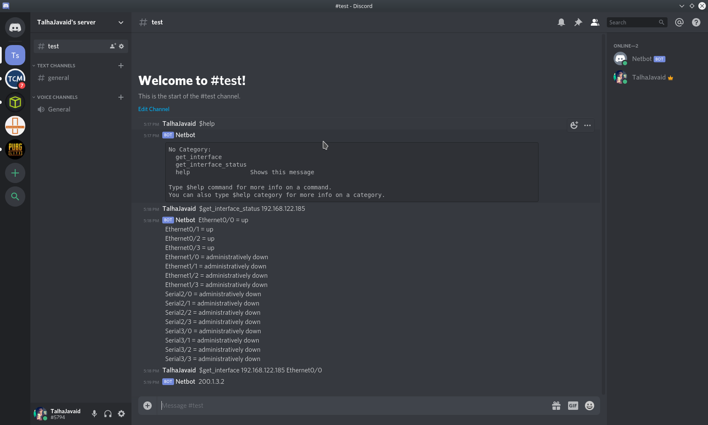

# Discord_ChatOps

 A demo for creating a Discord bot for ChatOps
 
 Guide for generating and inviting bot to your discord server
 
     https://discordpy.readthedocs.io/en/latest/discord.html#inviting-your-bot
     
     
 ## Installing dependencies
 
     #pip install -r requirements.txt
     
 ## Using our programmed bot in the discord server
 
 1. Run the script
    - our bot will become online
    
 2. type "$hello" to see functions
 3.type "$get_interface_status   _ip"  to get interface status 
 4. type "$get_interface  _ip  _interface_name_" to get interface ip
 
 
     
 
     
 
